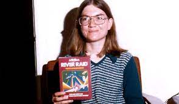

# Carol Shaw

Carol Shaw (1955 - *) é a primeira mulher a ser tornar funcionária
de uma empresa de games, como a Activision e Atari. E entrou para história como pioneira pela luta da igualdade de gêneros no ramo tecnológico.