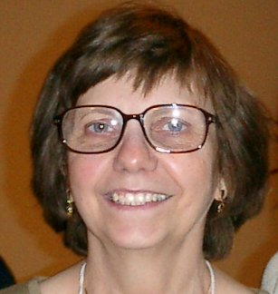

# Liane Tarouco

Liane Tarouco é doutora em Engenharia Elétrica/Sistema Digitais e docente na Universidade Federal do Rio Grande do Sul (UFRGS).

É coordenadora do Programa de Pós-Graduação, e desenvolve pesquisas na área de Informática na Educação sobre mundos virtuais imersivos, aprendizagem experiencial, metodologias ativas e mobile learning.

É a autora do primeiro livro sobre Redes de Computadores no Brasil.